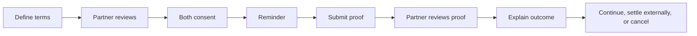

# PACT AI — Product Case Study

## Executive summary

PACT AI explores whether two people can form and complete a more trustworthy accountability agreement through SMS. The product structures the parts that informal agreements often leave vague: what is due, when it is due, what counts as proof, who reviews it, what happens after a miss, and how either person can exit.

My role in this project was primarily product-oriented: framing the problem, defining the user and safety boundary, turning user needs into requirements, prioritizing the MVP, mapping edge cases, specifying workflows, evaluating tradeoffs, and using prototypes and implementation feedback to refine the product.

[Launch the interactive prototype](https://manuelalonso85.github.io/pact-ai-prototype/)

## 1. The problem I chose to explore

Accountability tools tend to fail at one of two extremes:

- Informal agreements are easy to start but leave expectations and consequences open to interpretation.
- Dedicated apps can provide structure but require both people to install, learn, and continue using another product.

The opportunity was to test a smaller question: can a familiar channel and a deliberately constrained workflow make a two-person commitment easier to understand and trust?

### Initial product hypothesis

If two people can create, review, and complete an accountability pact through SMS, then they may experience less onboarding friction while gaining clearer rules and outcomes than they would through an informal conversation.

This is a hypothesis—not a validated market claim.

## 2. Target user and context

The initial user is not “everyone who wants motivation.” I narrowed the beta audience to:

- Two adults who already know and trust each other.
- One or both people making a repeated behavioral commitment, with each participant reviewing the other person's proof when applicable.
- People comfortable using SMS/MMS for a short, structured experiment.
- Low-stakes situations that do not require payment custody or formal dispute resolution.

This deliberately excludes strangers, minors, high-value agreements, automated collections, and users who need the product to arbitrate disputes.

### Four supported pact formats

Two product decisions create four possible combinations:

| | Specific days | Flexible weekly |
|---|---|---|
| One-Way | The creator submits proof on named weekdays; the partner reviews. | The creator completes a target on any eligible days Monday through Sunday. |
| Two-Way | Both participants submit and review proof, and each can choose different weekdays. | Both participants work toward the same weekly target and review each other's proof. |

The interactive prototype features **Two-Way + Specific days** because it demonstrates the most important two-sided behaviors without requiring the additional period and settlement rules of Flexible Weekly. The other formats are summarized in the interface rather than expanded into four separate demos.

## 3. Customer discovery: what is known and unknown

The underlying private project produced product requirements, workflow learning, and implementation feedback. It did not produce a formal, publishable interview repository or a defensible set of customer-discovery findings.

I therefore separate the evidence into three categories:

| Category | What I can say |
|---|---|
| Product hypothesis | SMS may reduce adoption friction; explicit rules may improve trust. |
| Prototype/implementation learning | Ambiguous replies, duplicate processing, carrier behavior, scheduling, and role-specific state materially affect the experience. |
| Still unvalidated | Willingness to adopt, long-term retention, the value of monetary stakes, acceptable proof standards, and willingness to review a partner consistently. |

### Discovery plan

Before expanding the product, I would conduct 8–12 interviews across both roles, followed by a five-pair concierge pilot. The research would test:

1. How people currently set and enforce accountability agreements.
2. Where current agreements become ambiguous or socially uncomfortable.
3. Whether SMS convenience outweighs privacy and message-volume concerns.
4. What users consider acceptable proof.
5. Whether a monetary stake improves commitment or reduces willingness to participate.
6. Which failures require product recovery and which require human conversation.

I would consider the initial workflow promising if most pilot pairs could activate without help, accurately explain the rules, submit and review proof, and trust the recorded outcome.

## 4. User needs translated into requirements

| User need | Product requirement | Why it matters |
|---|---|---|
| Start with little friction | Essential actions work over SMS/MMS | Avoid requiring another app for a two-person agreement. |
| Know exactly what was agreed | Both participants receive the same finalized summary and explicitly consent | Terms should not change by assumption. |
| Know what is due | Reminders identify the correct person, obligation, and date or period | Generic reminders weaken trust. |
| Avoid misattributed proof | Accept proof only when it maps safely to one eligible obligation | Correctness matters more than conversational flexibility. |
| Understand a result | Outcome messages identify the relevant obligation and consequence | Users should not need support to interpret a pass or fail. |
| Trust automation | Scheduled work is retry-safe and observable | A retry must not duplicate messages or consequences. |
| Leave responsibly | Cancellation accounts for both participants | A two-person agreement should not disappear unilaterally without notice. |
| Use a stake without giving the product custody | Participants settle externally; the product records only their confirmation | Keeps the MVP out of banking and escrow. |

## 5. The MVP decision

I defined the MVP as the smallest **trustworthy accountability loop**, not the smallest collection of screens.

### Prioritized for the MVP

1. Guided pact creation and partner acceptance.
2. Explicit schedules, roles, and consent.
3. Due-date-bound reminders.
4. Proof submission and partner review.
5. Retry-safe pass/fail evaluation.
6. Status, cancellation, and operational visibility.

### Deliberately deferred

- Automated payments or escrow.
- Automated dispute resolution.
- General conversational AI.
- Multiple simultaneous active pacts.
- Web and native mobile clients.
- Broad timezone support.
- Advanced analytics, achievements, and social mechanics.

These features could make the concept more marketable, but they would not prove the core behavior and would increase safety, ambiguity, and operational scope.

## 6. Key workflow decisions

### Consent before activation

Both participants should see the same final terms and take an affirmative action before the pact becomes active. This makes consent a product state, not merely message copy.

### Structured commands before conversational AI

Natural language would feel more flexible, but it creates risk when a message could approve proof, cancel a pact, or affect a monetary consequence. The MVP favors constrained commands and clear recovery messages.

### Partner review instead of automated proof judgment

The accountability partner determines whether proof is acceptable. This keeps the initial product aligned with an existing relationship and avoids presenting an opaque model judgment as objective truth.

### Explainable outcomes

A pass or fail must identify the applicable obligation. “You failed” is insufficient; users need to understand what date or period was evaluated and what consequence followed.

### Bounded financial scope

The product may help participants remember and record an agreed stake, but it does not collect, transfer, hold, or independently verify money. This boundary is both a scope decision and a trust decision.

## 7. Tradeoffs I accepted

| Decision | Benefit | Cost |
|---|---|---|
| SMS-first experience | Low onboarding friction | Carrier behavior, reserved keywords, privacy, and message length are harder to control. |
| Structured replies | Safer state transitions | Less conversational and less forgiving. |
| One active pact per person | Simpler routing and fewer ambiguous replies | Limits repeat and power-user scenarios. |
| One beta timezone | Clear operational cutoffs | Not suitable for broad availability. |
| External settlement | Avoids payment custody | Confirmation remains participant-reported. |
| Human proof review | Matches the accountability relationship | Review can be delayed or socially awkward. |

## 8. From product rules to system behavior

The implementation model uses:

- A state machine for guided conversations.
- Explicit participant roles and due obligations.
- Database constraints and atomic operations for duplicate prevention.
- Scheduled workers for reminders and evaluation.
- Idempotent processing so retries do not duplicate outcomes.
- Authentication boundaries for inbound webhooks and internal scheduled work.
- Structured logs designed to support debugging without exposing user-facing identifiers unnecessarily.

The public [architecture diagram](docs/architecture.md) shows the system boundary without revealing production configuration, project identifiers, credentials, or private operational procedures.

## 9. What the prototype demonstrates

The interactive prototype models a Mutual Pact from both perspectives:

- Alex defines the shared goal, Alex's commitment days, and the stake.
- Jordan receives the invitation and chooses separate commitment days.
- Both participants receive personalized terms and consent before activation.
- Alex submits synthetic proof and Jordan reviews it.
- On Jordan's scheduled day, the roles reverse: Jordan submits and Alex reviews.
- A later missed-day example identifies the date, stake, unsettled balance, and offset rule.

It is intentionally a simulation. Browser-local state replaces accounts, SMS delivery, media storage, scheduling, and the production database. This makes the portfolio demo safe to share while preserving the product logic recruiters need to evaluate.

## 10. Learning and iteration

Implementation work exposed product issues that a happy-path wireframe would have missed:

- A two-person pact needs role-specific schedules and messages.
- Incoming replies must be matched to exactly one valid pending action.
- Scheduled systems need retry-safe behavior and enough horizon to keep future obligations available.
- Carrier-specific behavior can conflict with product vocabulary and split text from media.
- Internal identifiers may help operators but should not leak into participant-facing messages.
- A cancellation flow needs to reflect that two people entered the agreement.
- Reliability and authorization are product quality, not only engineering concerns.

These lessons tightened the requirements and reinforced a central principle: in an accountability product, trust depends on correct state and understandable outcomes more than on conversational novelty.

## 11. Limitations and safety boundaries

- This is a portfolio prototype, not a production financial service.
- PACT AI is not a bank, escrow agent, debt collector, or dispute arbiter.
- SMS/MMS delivery is not guaranteed and can expose content on shared devices.
- Payment confirmation is self-reported.
- The initial design supports one operational timezone and one active/pending pact per participant.
- Ambiguous media delivery or incorrect replies may require support intervention.
- Production expansion would require privacy review, threat modeling, retention/deletion policies, abuse reporting, accessibility review, and live security validation.

## 12. What I would do next

1. Run the interview and concierge-pilot plan and revise the target segment based on evidence.
2. Test user comprehension of consent, proof, failure, cancellation, and stake wording.
3. Determine whether monetary stakes are essential or whether non-monetary consequences produce similar value.
4. Test the unhappy paths: rejection, missing proof, missed review, cancellation, and ambiguous replies.
5. Define success metrics only after the activation and accountability loop is stable.
6. Establish data retention, deletion, export, incident-response, and abuse-handling policies before a broader beta.

## 13. What I would measure

No portfolio metric should be presented as a real result without supporting evidence. For a controlled pilot, I would instrument:

- Invitation-to-consent completion rate.
- Time and drop-off by setup step.
- Percentage of due obligations receiving proof.
- Proof review completion time.
- Rate of ambiguous or unsupported replies.
- Reminder delivery and duplicate-send rate.
- Outcome comprehension and trust from follow-up interviews.
- Pair-level completion and repeat-pact intent.

## 14. Public-repository disclosure

This case study intentionally omits credentials, production configuration, private user or tester information, message logs, proof media, database exports, deployment procedures, private documents, and full source history. Examples use synthetic names and data. Operational lessons are summarized at the product level so the decision-making process is visible without exposing the private system.
