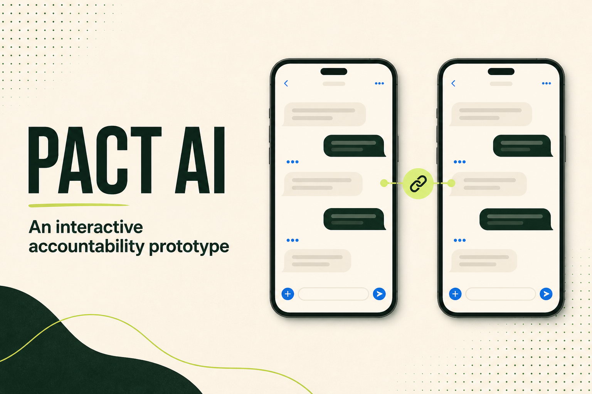

# PACT AI

An SMS-first accountability product prototype for two people who want more structure than a casual promise without the friction of another app.

[Try the live prototype](https://manuelalonso85.github.io/pact-ai-prototype/) · [Read the full product case study](CASE_STUDY.md) · [View the architecture](docs/architecture.md)



## What this demonstrates

This portfolio project focuses on product judgment:

- Turning an ambiguous social problem into a structured two-person workflow.
- Separating user hypotheses from validated product evidence.
- Prioritizing a trustworthy MVP over a broad feature set.
- Designing consent, proof, review, reminders, outcomes, and cancellation as one coherent system.
- Setting clear safety boundaries around money, privacy, automation, and AI.
- Translating product rules into an interactive prototype and technical requirements.

## Try the core loop

The safe browser prototype lets you play both participants:

1. Define a goal, schedule, and stake.
2. Send and accept the pact invitation.
3. Submit synthetic proof.
4. Approve it as the accountability partner.
5. See the explainable outcome and reset the flow.

The demo uses synthetic browser-local state. It sends no SMS, processes no payment, connects to no production system, and collects no personal data.

## Product snapshot

| | |
|---|---|
| Problem | Informal accountability breaks down when terms, evidence, review, and consequences are ambiguous. |
| Initial user | Two adults who already know and trust each other and want a short, structured commitment. |
| Product hypothesis | SMS lowers adoption friction while a constrained workflow improves clarity and follow-through. |
| MVP | Create, consent, remind, submit proof, review, evaluate, check status, and cancel safely. |
| Deliberately deferred | Money movement, dispute resolution, conversational AI, multiple simultaneous pacts, and broad timezone support. |
| Prototype boundary | Interactive simulation only; no live messaging, accounts, production data, or credentials. |

## Repository guide

- [`CASE_STUDY.md`](CASE_STUDY.md) — problem framing, discovery plan, requirements, prioritization, decisions, tradeoffs, learning, and next steps.
- [`app/page.tsx`](app/page.tsx) — interactive two-phone prototype and product state transitions.
- [`docs/architecture.md`](docs/architecture.md) — Mermaid architecture and trust boundaries.
- [`samples/redeem_invite_code.sql`](samples/redeem_invite_code.sql) — sanitized example of an atomic controlled-beta gate.
- [`.env.example`](.env.example) — placeholders only; unused by the public simulation.

## Run locally

Requirements: Node.js 22.13 or newer.

```bash
npm install
npm run dev
```

Open the local address printed in the terminal. Validate a production build with `npm test`.

## Portfolio disclosure

This is a sanitized public artifact derived from a private product project. It intentionally omits credentials, private configuration, production data, participant information, deployment records, internal operating documents, and full source history. Product claims are scoped in the case study; unvalidated customer assumptions are not presented as research findings.
