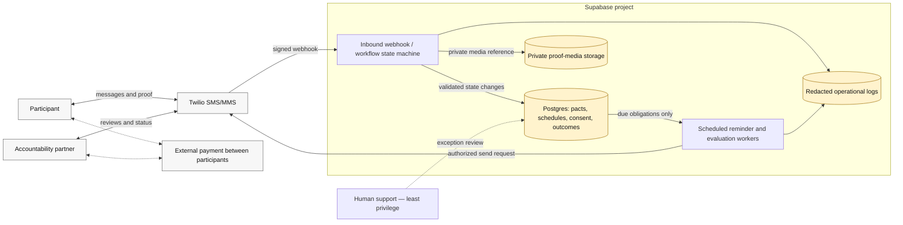

# Architecture and trust boundaries

## Boundary decisions

- Twilio webhook signatures and internal scheduled-job authentication are checked before state mutation.
- Service-role credentials stay server-side and are never placed in a client or screenshot.
- Phone numbers, proof media, consent, and outcomes are sensitive data; public demos use synthetic fixtures.
- Logs should use correlation identifiers and structured counts, not raw phone numbers, message bodies, or proof URLs.
- External settlement is outside the product boundary. The system records participant statements, not verified transfers.

